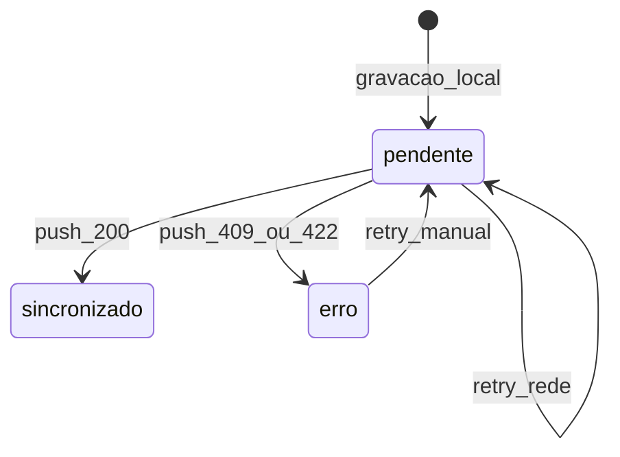

# ADR-002 — Sync Outbox e idempotência

| Campo | Valor |
|-------|-------|
| Status | **aceito** |
| Data | 2026-06-14 |
| Relacionado | ADR-001, `BR-SYNC-*`, `BR-SYNC-005` |

## Contexto

O PWA Cocal Campo opera offline-first (`BR-TRANS-001`). Registros são gravados localmente e sincronizados automaticamente (`BR-TRANS-002`, `BR-SYNC-002`). Conflitos entre dispositivos seguem **first-sync-wins** (`BR-SYNC-005`).

## Decisão

Adotar o padrão **Transactional Outbox** no cliente com idempotência explícita no servidor.

### Cliente (IndexedDB)

1. Toda escrita cria/atualiza registro local com status `pendente`.
2. Tabela `sync_outbox` espelha itens pendentes com `retry_count` e `last_error_code`.
3. `SyncEngine` observa eventos `online` e envia fila em ordem FIFO.
4. Estados: `pendente` → `sincronizado` | `erro` (`BR-SYNC-001`).

### Chave de idempotência

```
idempotency_key = "{turno_id}:{tipo_registro}:{identificador}"
```

- `identificador`: UUID do registro no cliente (gerado na criação offline).
- Mesma chave + payload idêntico → resposta idempotente 200.
- Mesma chave + payload divergente → `409 ERR-SYNC-CONFLICT` (`BR-SYNC-005`).

### Servidor (Go + PostgreSQL)

1. `POST /api/v1/sync/push` recebe batch ou item único.
2. Validações de domínio antes do INSERT: `TMP-001`, `TMP-002`, `BR-TURNO-*`.
3. `UNIQUE (idempotency_key)` no PostgreSQL — primeiro INSERT vence.
4. Conflito detectado por hash de payload diferente para mesma chave → 409.
5. Falha de rede no cliente → retry com backoff (`BR-SYNC-004`); dado local nunca apagado.

### Fluxo de estados



## Implementação

| Camada | Caminho |
|--------|---------|
| SyncEngine | `frontend/src/lib/sync/engine.ts` |
| Outbox Dexie | `frontend/src/lib/db/schema.ts` |
| Sync handler | `backend/internal/http/handlers/sync.go` |
| Domínio sync | `backend/internal/service/sync.go` |

## Regras de negócio atendidas

| ID | Como |
|----|------|
| `BR-SYNC-001` | Fila local com status visível |
| `BR-SYNC-002` | Sync automático ao detectar online |
| `BR-SYNC-003` | UI `SyncStatus` exibe pendências e última sync |
| `BR-SYNC-004` | Retry sem apagar local |
| `BR-SYNC-005` | first-sync-wins via UNIQUE + comparação de payload |
| `BR-TRANS-004` | `synced_at` preenchido; PATCH bloqueado para operadores |

## Alternativas consideradas

| Opção | Motivo de rejeição |
|-------|-------------------|
| CRDT / merge automático | Contradiz `BR-SYNC-005` first-sync-wins |
| Last-write-wins | Overwrite silencioso proibido pelo catálogo |
| Sync-as-a-service | Política de conflito opaca vs `BR-*` |

**Última atualização**: 2026-06-14
