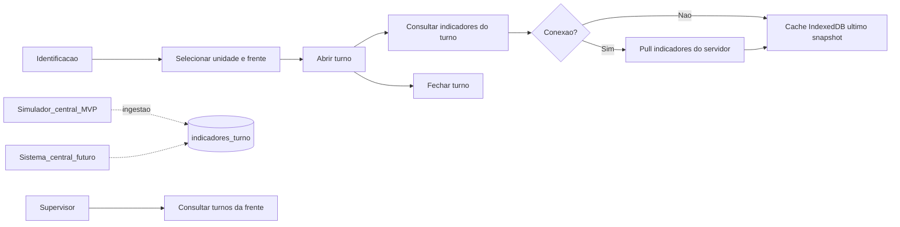

# Documento transversal — fluxo mestre Cocal Campo

> Jornada end-to-end do PWA de frente. Regras que cruzam todos os módulos.

## Fluxo alvo (diagrama)

## Lacunas e backlog conhecidos

| Lacuna | Módulos afetados | Prioridade | Status |
|--------|------------------|------------|--------|
| Política de resolução de conflito quando dois registros offline do mesmo indicador/turno divergem | offline-sync, todos os módulos de registro | alta | **Resolvida** — ver `BR-SYNC-005` |
| Quem valida ocorrência de segurança (supervisor, central, ambos?) | seguranca, supervisao | alta | **Resolvida** — ver `BR-SEGURANCA-004` |
| Origem dos valores **planejados** no MVP (cadastro manual, importação, integração futura) | performance, colheita, transporte, qualidade | média | **Resolvida** — ver `BR-PERFORMANCE-003` |
| Integração futura com painel Gestão à Vista | performance, supervisao | baixa (Fase 4) | Aberta |
| Contrato API sistema central do cliente | integracao-central | alta | **Aberta** — MVP usa `BR-INTEG-005` simulador |

### Decisões do workshop (2026-06-14)

| Tópico | Decisão | Regra |
|--------|---------|-------|
| Conflito offline | Primeiro sync bem-sucedido prevalece; segundo dispositivo recebe erro de conflito e registro fica em fila com status **erro** até resolução pelo supervisor | `BR-SYNC-005` |
| Autenticação no campo | Primeiro login exige conexão; sessão offline válida por 7 dias com renovação online | `BR-ACESSO-004` |
| Registros obrigatórios no fechamento (`INT-001`) | Na fundação (`BRF-001`): lista vazia — sem indicadores de área. Obrigatoriedade entra com briefings de área (`BRF-002+`) | nota em `INT-001` abaixo |
| Validação de ocorrência de segurança | Supervisor da frente valida em até 24h; contador só zera após validação | `BR-SEGURANCA-004` |
| Metas planejadas no MVP | Cadastro manual por supervisor ou perfil administrativo da unidade | `BR-PERFORMANCE-003` |

## Regras transversais

### BR-TRANS-001 — Consulta offline do último snapshot

| Campo | Valor |
|-------|-------|
| **Enunciado** | A **consulta de indicadores** do turno deve funcionar **sem conexão** usando o **último snapshot** sincronizado localmente. |
| **Escopo** | Telas de consulta colheita e supervisão. |
| **Perfis** | Operadores e supervisores. |
| **Efeito** | UI exibe cache local quando offline; mensagem se nunca houve sync. |
| **Implementação** | `frontend/src/lib/indicadores/cache.ts`, `BR-INTEG-004` |
| **Estado** | implementado |

---

### BR-TRANS-002 — Atualização automática de indicadores

| Campo | Valor |
|-------|-------|
| **Enunciado** | Quando houver conexão, indicadores **atualizam automaticamente** em background, sem ação manual obrigatória. |
| **Escopo** | Pull de `GET /turnos/atual/indicadores`; painel supervisor. |
| **Perfis** | Todos com telas de consulta. |
| **Efeito** | Refresh periódico e ao retorno online; ver `BR-SYNC-PULL-001`. |
| **Implementação** | `frontend/src/lib/indicadores/pull.ts` |
| **Estado** | implementado |

---

### BR-TRANS-003 — Vínculo obrigatório a turno, frente e unidade

| Campo | Valor |
|-------|-------|
| **Enunciado** | Todo registro operacional vincula-se a **turno aberto**, **frente de trabalho**, **unidade** e **área** do profissional. |
| **Escopo** | Criação de qualquer registro de indicador ou ocorrência. |
| **Perfis** | Todos (exceto consultas de leitura histórica conforme `BR-ACESSO-*`). |
| **Efeito** | Bloqueio se turno não estiver aberto (`TMP-002`). |
| **Implementação** | `frontend/src/features/turno/ContextoPage.tsx`, `backend/internal/service/services.go` — ver [turnos.md](./turnos.md) |
| **Estado** | implementado |

---

### BR-TRANS-004 — Imutabilidade pós-sync

| Campo | Valor |
|-------|-------|
| **Enunciado** | Registro preserva **autoria**, **timestamp de criação** e **identificação do dispositivo**; após sync bem-sucedido torna-se **imutável** para operadores (alteração apenas por perfis autorizados com trilha de auditoria). |
| **Escopo** | Todos os registros sincronizados. |
| **Perfis** | Operadores: somente leitura pós-sync; supervisor conforme `BR-SUPERVISAO-*`. |
| **Efeito** | Bloqueio de edição direta pós-sync para operadores. |
| **Implementação** | `backend/migrations/001_init.sql` (`synced_at`, sem UPDATE para operadores na fundação), status local `sincronizado` |
| **Estado** | implementado |

---

### BR-TRANS-005 — Semântica executado vs planejado

| Campo | Valor |
|-------|-------|
| **Enunciado** | Quando meta planejada estiver disponível, a comparação com o executado usa semântica de negócio **dentro da meta** ou **fora da meta** (referência operacional Gestão à Vista). |
| **Escopo** | Indicadores de performance e qualidade com meta cadastrada. |
| **Perfis** | Todos com permissão de visualização do indicador. |
| **Efeito** | Informativo na UI; não bloqueia registro fora da meta. |
| **Implementação** | `frontend/src/lib/gestao-vista/comparacao.ts` |
| **Estado** | implementado |

## Validações temporais (`TMP-*`)

| ID | Enunciado |
|----|-----------|
| `TMP-001` | Evento operacional não pode ter data/hora **futura** em relação ao relógio do dispositivo no momento do registro |
| `TMP-002` | Registro só é válido dentro de **turno aberto** do usuário, exceto supervisor com permissão explícita (`BR-SUPERVISAO-003`) |

## Integridade (`INT-*`)

| ID | Enunciado |
|----|-----------|
| **INT-001** | Fechamento de turno exige registros obrigatórios **somente quando o perfil registra dados no app**. **Modelo consulta (BRF-005+):** operadores de campo **não** registram indicadores — fechamento **sem** obrigatoriedade de indicadores. Ingestão via simulador não bloqueia fechamento do operador. |
| `INT-002` | Contador de dias sem acidentes só muda por **ocorrência registrada e validada** — nunca por edição manual livre do contador |

---

**Última atualização**: 2026-06-16
