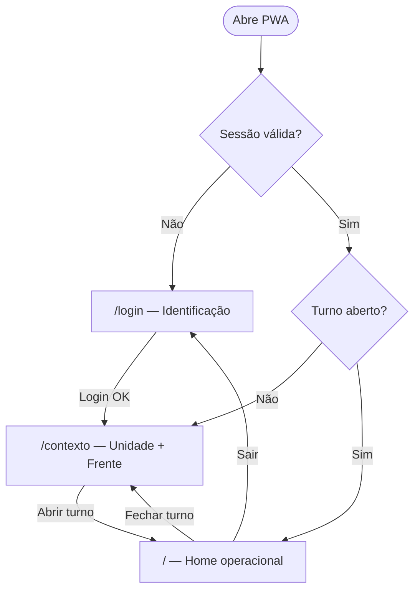
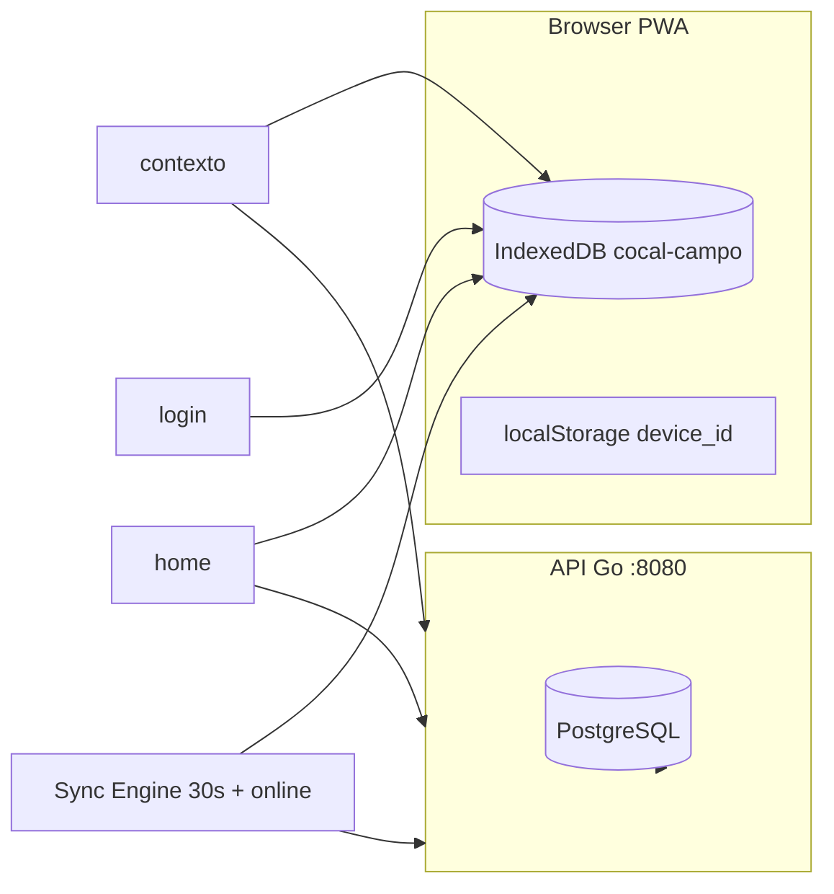

# Fluxo do usuário e informações — Cocal Campo (fundação BRF-001)

> **Atualização:** jornadas de visualização (colheita, supervisor, simulador) estão em [`fluxo-usuario-visualizacao.md`](./fluxo-usuario-visualizacao.md). Este documento cobre a **fundação** turno/sync.

> Guia do que a aplicação oferece na fundação: login, seleção de contexto, ciclo de turno, sync offline. Briefing: [`BRF-001`](../briefings/BRF-001-fundacao-turno-sync.md).

## Contexto

A aplicação em desenvolvimento (`http://localhost:5173` + API `:8080`) implementa a **fundação operacional** (login, contexto, turno, sync) e, desde BRF-005/006/007, **consulta read-only** de indicadores. Formulários de registro pelo operador foram substituídos por visualização — ver [`fluxo-usuario-visualizacao.md`](./fluxo-usuario-visualizacao.md).

---

## Jornada do usuário (3 rotas)

Rotas definidas em [`frontend/src/App.tsx`](../../frontend/src/App.tsx):

| Rota | Tela | Quando aparece |
|------|------|----------------|
| `/login` | Login | Sem sessão válida |
| `/contexto` | Contexto operacional | Após login ou após fechar turno |
| `/` | Home | Com sessão + turno aberto (ou carregado do servidor/local) |

Qualquer outra URL redireciona para `/`.

---

## Tela 1 — Login (`/login`)

**Arquivo:** [`frontend/src/features/auth/LoginPage.tsx`](../../frontend/src/features/auth/LoginPage.tsx)

**O que o usuário vê:**

- Título "Cocal Campo"
- Subtítulo citando `BR-ACESSO-004` (login online obrigatório)
- Campos: e-mail e senha
- Botão "Entrar"
- Mensagem de erro se credenciais/conexão falharem

**Credenciais de teste** (seed em [`backend/migrations/002_seed.sql`](../../backend/migrations/002_seed.sql)):

| E-mail | Senha | Nome | Perfil | Área |
|--------|-------|------|--------|------|
| `colheita@cocal.dev` | `campo123` | Operador Colheita | `operador_colheita` | colheita |
| `transporte@cocal.dev` | `campo123` | Operador Transporte | `operador_transporte` | transporte |
| `supervisor@cocal.dev` | `campo123` | Supervisor Frente | `supervisor_frente` | supervisao |

**O que acontece ao entrar:**

1. `POST /api/v1/auth/login` → retorna tokens + objeto `usuario`
2. Sessão salva no **IndexedDB** (`db.session`) via [`saveSession`](../../frontend/src/lib/auth/session.ts)
3. `device_id` gerado/persistido em `localStorage` (`cocal_device_id`)
4. Redireciona para `/contexto`

**Regra:** login exige rede (`BR-ACESSO-004`). Depois disso, a sessão pode ser usada offline por até **7 dias**.

---

## Tela 2 — Contexto operacional (`/contexto`)

**Arquivo:** [`frontend/src/features/turno/ContextoPage.tsx`](../../frontend/src/features/turno/ContextoPage.tsx)

**O que o usuário vê:**

- Título "Contexto operacional"
- Subtítulo citando `BR-TRANS-003` (vínculo turno/frente/unidade)
- Select **Unidade** (lista da API)
- Select **Frente** (filtrada pela unidade)
- Botão "Abrir turno"
- Erro se abertura falhar

**Dados disponíveis no seed:**

| Unidade | Frentes |
|---------|---------|
| Paraguacu Paulista | Frente Colheita 01, Frente Transporte 01 |
| Narandiba | _(sem frentes no seed)_ |

**Lógica de entrada na tela:**

- Sem token → volta para `/login`
- Perfil **supervisor** → redireciona para `/supervisao` (não usa esta tela)
- Turno aberto local ou remoto → pula direto para `/` (catálogo é atualizado em segundo plano no login)
- Caso contrário → carrega unidades da API (online) ou do **cache IndexedDB** (offline)
- Após fechar turno offline, unidade/frente do último turno são pré-selecionados

**Cache local (schema v3):** tabelas `unidades` e `frentes` em [`contexto-cache.ts`](../../frontend/src/lib/catalog/contexto-cache.ts). Populadas no login e em cada visita online à tela. Offline exibe rótulo "Catálogo local (offline)".

**Ao clicar "Abrir turno":**

- **Online:** `POST /api/v1/turnos` com `id`, `unidade_id`, `frente_id`, `device_id`, `inicio`
  - Se `ERR-TURNO-002` (já existe turno aberto) → recupera turno atual e vai para home
- **Offline:** grava turno localmente no IndexedDB (`db.turno_atual`) e vai para home
- Redireciona para `/`

---

## Tela 3 — Home operacional (`/`)

**Arquivo:** [`frontend/src/features/home/HomePage.tsx`](../../frontend/src/features/home/HomePage.tsx)

**Barra superior** ([`SyncStatusBar`](../../frontend/src/features/sync/SyncStatusBar.tsx)) — visível em home e durante carregamento:

| Indicador | Origem | Significado |
|-----------|--------|-------------|
| Online / Offline | `navigator.onLine` | Conectividade do browser |
| Pendências: N | `db.sync_meta.pending_count` | Registros `pendente` + `erro` na fila |
| Última sync | `db.sync_meta.last_success_at` | Último push bem-sucedido |

**Cabeçalho do usuário:**

- Saudação: `Olá, {nome}`
- Subtítulo: rótulos amigáveis de perfil e área (`labelPerfil` · `labelArea`)

**Card "Turno {status}"** — somente **operadores** (não supervisor nem simulador):

- Status: `aberto` ou `fechado`
- Início formatado (`pt-BR`)
- Se **aberto**:
  - Botão **Registrar placeholder** → transporte, qualidade e segurança (colheita não exibe — consulta via atalho)
  - Botão **Fechar turno** → `POST .../turnos/{id}/fechar` (online) ou fecha local (offline) → volta a `/contexto`
- Ações operacionais ficam aqui; **links de navegação ficam no card Atalhos**

**Card "Atalhos"** (`data-testid="home-atalhos"`):

- Destinos por perfil/área via `getHomeAtalhos()` em [`HomePage.tsx`](../../frontend/src/features/home/HomePage.tsx)
- Item com `to` → botão-link; sem `to` → texto hint (rota ainda não implementada)
- Operadores: atalhos só com turno **aberto**

| Perfil / área | Itens | Navegação |
|---------------|-------|-----------|
| `supervisor_frente` | Abrir painel da frente, Gestão à vista | `/supervisao`, `/gestao-a-vista` |
| `simulador_central` | Simular ingestão do sistema central, Gestão à vista | `/simulador`, `/gestao-a-vista` |
| colheita | Consultar desempenho do turno | `/colheita` |
| transporte | Consultar turno | hint (sem rota) |
| qualidade | Consultar avaliações | hint (sem rota) |
| seguranca | Consultar segurança | hint (sem rota) |

- Não há card **Menu** separado — evita duplicar os mesmos destinos
- `BR-ACESSO-001`: atalhos filtrados por `usuario.perfil` / `usuario.area`

**Card "Registros locais":**

- Operadores de **transporte, qualidade e segurança** (colheita consulta indicadores centralizados; supervisor/simulador não exibem)
- Lista da fila IndexedDB (`db.registros`), mais recentes primeiro
- Cada item: `{tipo} — {sync_status}` e código de erro se houver (`last_error_code`)
- Conflito permanente (`ERR-SYNC-CONFLICT`): botão **Aceitar versão do servidor**

**Botão "Sair":**

- Limpa sessão local + turno local
- `POST /api/v1/auth/logout` se online
- Redireciona para `/login`

**Guard de rota:** sem sessão → `/login`; operador sem turno → `/contexto`. Supervisor e simulador após login vão direto para `/supervisao` ou `/simulador` ([`postLoginPath`](../../frontend/src/lib/auth/routes.ts)); podem acessar `/` via breadcrumb «Início».

---

## Onde os dados vivem

**IndexedDB** ([`frontend/src/lib/db/schema.ts`](../../frontend/src/lib/db/schema.ts)):

| Store | Conteúdo |
|-------|----------|
| `session` | tokens, expiração, `usuario` completo |
| `turno_atual` | turno aberto/fechado do dispositivo |
| `registros` | fila de eventos com `sync_status` |
| `sync_meta` | contador de pendências + última sync |
| `unidades` | catálogo local de unidades operacionais |
| `frentes` | catálogo local de frentes por unidade |

**API** ([`frontend/src/lib/api/client.ts`](../../frontend/src/lib/api/client.ts)):

| Endpoint | Uso |
|----------|-----|
| `POST /api/v1/auth/login` | Login |
| `POST /api/v1/auth/refresh` | Renovar token online |
| `POST /api/v1/auth/logout` | Encerrar sessão |
| `GET /api/v1/unidades` | Listar unidades |
| `GET /api/v1/unidades/{id}/frentes` | Listar frentes |
| `POST /api/v1/turnos` | Abrir turno |
| `GET /api/v1/turnos/atual` | Recuperar turno aberto |
| `POST /api/v1/turnos/{id}/fechar` | Fechar turno |
| `POST /api/v1/sync/push` | Enviar fila de registros |

---

## Sync automática (em segundo plano)

Iniciada em [`main.tsx`](../../frontend/src/main.tsx) via `startSyncEngine()`:

1. A cada **30 segundos** e ao voltar **online**
2. Sincroniza turno local se aberto offline
3. Envia registros `pendente`/`erro` via `sync/push`
4. Atualiza status para `sincronizado` ou `erro` + código

Estados de sync: `pendente` → `sincronizado` | `erro` (`BR-SYNC-*`).

---

## Regras de negócio visíveis no app

| Regra | Comportamento na UI |
|-------|---------------------|
| `BR-ACESSO-004` | Login só online; depois offline até 7 dias |
| `BR-TRANS-003` | Turno vinculado a unidade + frente escolhidas |
| `BR-TURNO-001` | Sem turno → redireciona para contexto |
| `BR-TURNO-002` | Um turno aberto por usuário (409 na API) |
| `BR-TURNO-003` | Turno fechado: sem botões de registro/fechar |
| `BR-SYNC-003` | Barra de status com online/pendências/última sync |
| `BR-ACESSO-001` | Atalhos filtrados por perfil/área (`getHomeAtalhos`) |
| `TMP-002` | Registro placeholder só com turno `aberto` |

---

## O que ainda NÃO existe (fora do escopo BRF-001)

- Integração real com sistema central (Fase 3)
- Consulta transporte/qualidade/segurança para operadores (atalhos hint na home, sem rota)
- Gestão à Vista / metas planejadas completas

Consulta colheita, painel supervisor e simulador: ver [`fluxo-usuario-visualizacao.md`](./fluxo-usuario-visualizacao.md).

---

## Roteiro sugerido para explorar no browser

### Fundação turno + sync (transporte)

1. Abrir `http://localhost:5173/login`
2. Entrar com `transporte@cocal.dev` / `campo123`
3. Selecionar **Paraguacu Paulista** + **Frente Transporte 01** → Abrir turno
4. Na home: observar perfil/área, card turno, card **Atalhos**, barra de sync
5. Clicar **Registrar placeholder** → ver item em **Registros locais** com `pendente`, depois `sincronizado`
6. **Fechar turno** → volta ao contexto
7. (Opcional) Desligar rede no DevTools → abrir turno offline → registrar → reconectar → observar sync

### Consulta colheita (BRF-005)

1. Login `colheita@cocal.dev` / `campo123` → abrir turno
2. Card **Atalhos** → **Consultar desempenho do turno** → `/colheita`
3. Voltar via **Voltar ao início** (topo ou rodapé)

Para inspecionar dados locais: DevTools → Application → IndexedDB → `cocal-campo`.

Checklists relacionados: [regressao-fundacao-turno-sync.md](../tests/regressao-fundacao-turno-sync.md), [validacao-offline-campo.md](../tests/validacao-offline-campo.md).

---

**Última atualização**: 2026-06-16
