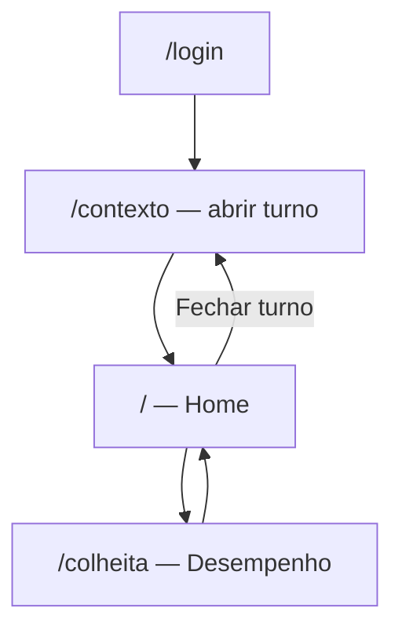
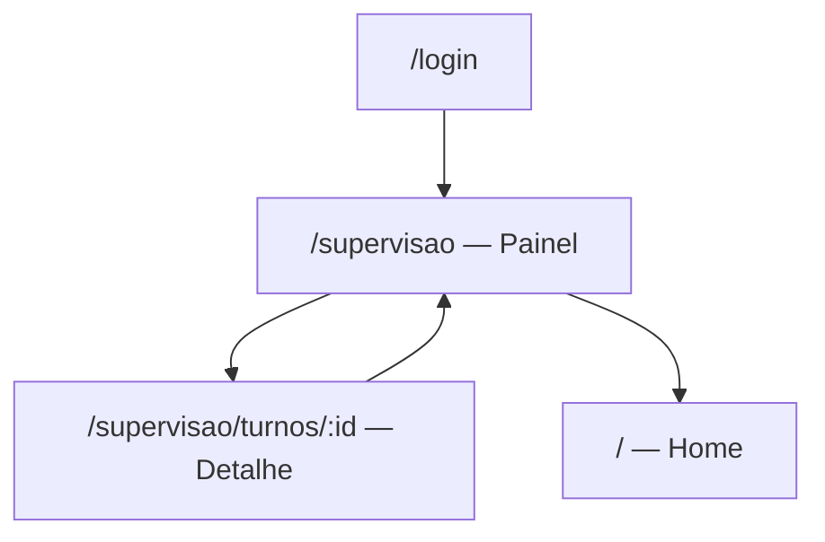
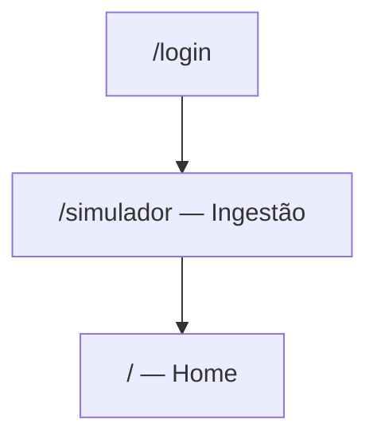
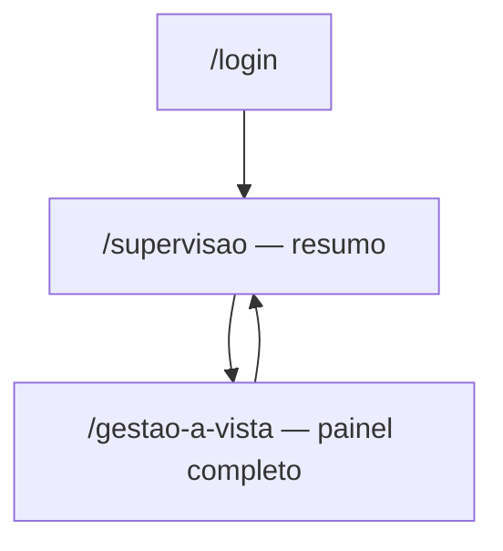

# Fluxo do usuário — visualização (BRF-005/006/007/008)

> Jornadas atuais por perfil: consulta colheita, painel supervisor, Gestão à Vista e simulador central. Fundação turno/sync: [`fluxo-usuario-brf-001.md`](./fluxo-usuario-brf-001.md).

## Contexto

A PWA em `http://localhost:5173` (API `:8080`) implementa **consulta read-only** de indicadores originados no sistema central. No MVP, o perfil **simulador** alimenta a base simulando o central (`BR-INTEG-005`).

---

## Credenciais de teste (seed)

| E-mail | Senha | Perfil | Jornada principal |
|--------|-------|--------|---------------------|
| `colheita@cocal.dev` | `campo123` | Operador colheita | Abrir turno → consultar desempenho |
| `supervisor@cocal.dev` | `campo123` | Supervisor frente | Painel da frente → detalhe turno |
| `simulador@cocal.dev` | `campo123` | Simulador central | Ingerir indicadores em turno alheio |

Unidade seed: **Paraguacu Paulista**. Frentes: Colheita 01, Transporte 01, Qualidade 01.

---

## Rotas

| Rota | Tela | Perfis |
|------|------|--------|
| `/login` | Identificação | Todos |
| `/contexto` | Unidade + frente + abrir turno | Operadores (não supervisor/simulador) |
| `/` | Home operacional | Todos autenticados |
| `/colheita` | Desempenho do turno (read-only) | Operador colheita |
| `/supervisao` | Painel da frente | Supervisor frente |
| `/supervisao/turnos/:id` | Detalhe turno da equipe | Supervisor frente |
| `/gestao-a-vista` | Painel Gestão à Vista (unidade) | Supervisor, simulador, operadores da unidade |
| `/simulador` | Ingestão simulada | Simulador central |

Entrada pós-login:

- **Simulador** → `/simulador`
- **Supervisor** → `/supervisao` (sem abrir turno próprio)
- **Demais** → `/contexto`

---

## Jornada — Operador Colheita

**O que o usuário vê em `/colheita`:**

- Seções **Performance** e **Qualidade** com cards legíveis (ex.: "Horas de corte", "Entrada de cana")
- Badges: Disponível / Em processamento na usina / Indisponível
- Comparação com meta quando disponível
- Timestamp da última atualização
- Dados via `GET /turnos/atual/indicadores` + cache IndexedDB offline

**Home:** menu "Consultar desempenho"; card de turno com atalho; sem card "Registros locais" (operador não registra indicadores).

---

## Jornada — Supervisor de Frente

**O que o usuário vê:**

- Lista de turnos abertos na frente (nome, área, início)
- Seletor de frente quando o supervisor tem mais de uma frente atribuída
- Polling automático a cada 45s (online)
- Detalhe read-only com mesmos indicadores agrupados (Performance / Qualidade)
- **Gestão à Vista inline** — dias sem acidentes + matriz Performance/Qualidade completa (sem navegar para outra rota)
- Breadcrumb: Início › Painel › Operador

**Não precisa** abrir turno próprio para consultar (BRF-006).

---

## Jornada — Simulador Central

**O que o usuário vê:**

- Banner "Modo simulação — ingestão como sistema central"
- Seletor de frente (se múltiplas atribuídas) e turno alvo
- Formulários editáveis: horas de corte, consumo/densidade, entrada de cana, impurezas
- Aba **Painel Gestão à Vista**: publica snapshot por unidade (`PUT /unidades/{id}/gestao-vista`)
- Push online direto (`POST /sync/push`); materialização em `indicadores_turno`

---

## Jornada — Gestão à Vista (BRF-008)

**O que o usuário vê em `/gestao-a-vista` (atalho opcional):**

- Mesmo dashboard inline do supervisor, em layout dedicado e largura ampliada
- Rota `/gestao-a-vista` permanece como atalho na home do supervisor

---

## Roteiro piloto (demo end-to-end)

1. **Operador colheita** — login → Paraguacu + Frente Colheita 01 → Abrir turno
2. **Simulador** — login → selecionar turno do operador → "Horas de corte" → sucesso
3. **Operador colheita** — "Consultar desempenho" → card "Horas de corte" com badge **Disponível**
4. **Supervisor** — login → painel lista turno do operador → resumo Gestão à Vista → painel completo
5. **Operador colheita** — Fechar turno

Testes E2E: `frontend/e2e/colheita.spec.ts`, `supervisao.spec.ts`, `gestao-vista.spec.ts`.

---

## Componentes de navegação

- **SyncStatusBar** — online/offline, pendências, última sync (home e telas operacionais)
- **PageHeader** — título, subtítulo, breadcrumb e `backTo` opcional no topo
- **PageFooter** — botão voltar sticky no rodapé (`page-has-footer` no `<main>`)
- **BackLink** — seta ←; variantes `inline` (header) e `bar` (footer)
- **Home** — card **Atalhos** por perfil/área (`getHomeAtalhos`); turno só ações operacionais

---

## O que ainda NÃO existe

- Integração real com sistema central (Fase 3)
- Consulta transporte/qualidade/segurança para operadores (atalhos placeholder na home, sem rota)
- Layout TV pixel-perfect Gestão à Vista
- Fluxo ocorrências de segurança (BR-SEGURANCA-001/003/004)
- Resumo agregado por setor no painel supervisor (BR-SUPERVISAO-001 parcial)

---

**Última atualização**: 2026-06-16
