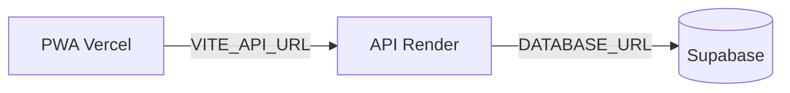

# 🚀 Deploy Notes — Cocal Campo

> Deploy, variáveis de ambiente, migrações e troubleshooting.

## Arquitetura de produção (Render + Vercel + Supabase)

| Componente | Plataforma | Artefato / config |
|------------|------------|-------------------|
| API Go | [Render](https://render.com) Web Service (Docker) | [`backend/Dockerfile`](../backend/Dockerfile), [`render.yaml`](../render.yaml) |
| PWA React | [Vercel](https://vercel.com) | [`frontend/`](../frontend/), [`frontend/vercel.json`](../frontend/vercel.json) |
| PostgreSQL | [Supabase](https://supabase.com) | Connection string Direct/Session |



## Ordem de deploy (primeira vez)

1. **Supabase** — validar connection string (Direct ou Session pooler; evitar Transaction pooler para migrations no boot).
2. **Render** — criar Web Service (passos abaixo); primeiro deploy aplica `001_init.sql` (`002_seed.sql` é ignorado com `APP_ENV=production`).
3. **Validar API** — `curl https://<api>.onrender.com/health` → 200.
4. **Vercel** — deploy do `frontend/` com `VITE_API_URL=https://<api>.onrender.com`.
5. **CORS** — no Render, definir `CORS_ORIGIN` = URL exata do PWA (ex. `https://cocal-campo.vercel.app`); redeploy manual.
6. **Dados** — executar SQL de produção no Supabase ([`scripts/prod-seed-template.sql`](../scripts/prod-seed-template.sql)).

## Render — Web Service

### Opção A: Blueprint

Dashboard → **Blueprints** → **New Blueprint Instance** → repositório `ceial-cocal-campo` → [`render.yaml`](../render.yaml).

Preencher variáveis `sync: false`:

| Variável | Valor |
|----------|-------|
| `DATABASE_URL` | URI Supabase (`?sslmode=require`) |
| `CORS_ORIGIN` | URL do PWA na Vercel (após passo 4) |
| `JWT_SECRET` | Gerado pelo Render ou `openssl rand -base64 32` |

### Opção B: Manual

| Campo | Valor |
|-------|-------|
| Runtime | Docker |
| Dockerfile path | `backend/Dockerfile` |
| Docker context | `backend` |
| Health Check Path | `/health` |
| Branch | `main` |

### Variáveis de ambiente (Render)

| Variável | Obrigatória | Descrição |
|----------|-------------|-----------|
| `APP_ENV` | Sim | `production` — pula seed dev e `EnsureDevUsers` |
| `DATABASE_URL` | Sim | Connection string Supabase |
| `JWT_SECRET` | Sim | Segredo forte (≠ `dev-secret-change-in-prod`) |
| `CORS_ORIGIN` | Sim | URL do PWA, sem barra final |
| `PORT` | Não | Render injeta automaticamente |

## Vercel — PWA

| Campo | Valor |
|-------|-------|
| Root Directory | `frontend` |
| Framework | Vite |
| Build Command | `npm run build` |
| Output Directory | `dist` |
| Install Command | `npm ci` |

### Variável de build (Production)

| Variável | Valor |
|----------|-------|
| `VITE_API_URL` | `https://<seu-servico>.onrender.com` |

`VITE_API_URL` é embutida em build time — alterações exigem redeploy do frontend.

SPA: [`frontend/vercel.json`](../frontend/vercel.json) reescreve rotas (`/login`, `/contexto`, etc.) para `index.html`.

## Supabase — banco e dados

### Connection string

- **Usar:** Direct connection ou Session pooler.
- **Evitar:** Transaction pooler (migrations no startup podem falhar).

### Dados iniciais

Com `APP_ENV=production`, a API **não** cria usuários `@cocal.dev`. Inserir dados reais:

```bash
# No Dev Container, pasta backend/
go run ./cmd/hash-password "SuaSenhaSegura"
```

Editar e executar [`scripts/prod-seed-template.sql`](../scripts/prod-seed-template.sql) no SQL Editor do Supabase.

Se houver resíduo de testes:

```sql
DELETE FROM usuarios WHERE email LIKE '%@cocal.dev';
```

## Build local (via Docker)

```bash
docker compose -f docker-compose.yml build api
docker compose run --rm frontend npm run build
# Artefato: frontend/dist/
```

## Variáveis de ambiente — resumo

| Variável | Onde | Descrição |
|----------|------|-----------|
| `APP_ENV` | Render | `production` em prod |
| `DATABASE_URL` | Render | PostgreSQL Supabase |
| `JWT_SECRET` | Render | Assinatura JWT |
| `CORS_ORIGIN` | Render | Origem única do PWA |
| `PORT` | Render | Default `8080` (Render sobrescreve) |
| `VITE_API_URL` | Vercel | URL base da API (build time) |

## Desenvolvimento

Ver [`techContext.md`](techContext.md) — Dev Container + F5 (`launch.json`) ou `docker compose --profile stack up -d`.

## Checklist pós-deploy

- [ ] `GET https://<api>/health` → 200
- [ ] Login com usuário real (não `@cocal.dev`)
- [ ] PWA em HTTPS com Service Worker ativo
- [ ] Abrir turno e sync push online
- [ ] Offline: registro local + sync após reconexão ([`docs/tests/validacao-offline-campo.md`](../docs/tests/validacao-offline-campo.md))
- [ ] `CORS_ORIGIN` coincide com URL da Vercel

## Troubleshooting

| Sintoma | Causa provável | Ação |
|---------|----------------|------|
| CORS bloqueado no browser | `CORS_ORIGIN` incorreto | Igualar URL exata da Vercel; redeploy Render |
| API 401 em todas as rotas | `JWT_SECRET` trocado | Usuários precisam logar de novo |
| Migration falha no boot | Transaction pooler Supabase | Usar Direct/Session connection string |
| Rotas `/login` 404 na Vercel | Falta rewrite SPA | Confirmar `frontend/vercel.json` |
| Frontend chama localhost | `VITE_API_URL` ausente no build | Definir na Vercel e redeploy |
| Cold start lento | Plano free Render | Upgrade ou aceitar delay inicial |

## Gate de deploy

- CI verde (`.github/workflows/ci.yml`)
- `npm run validate` OK
- Checklist [`docs/tests/validacao-offline-campo.md`](../docs/tests/validacao-offline-campo.md) em piloto

**Última atualização**: 2026-06-15
