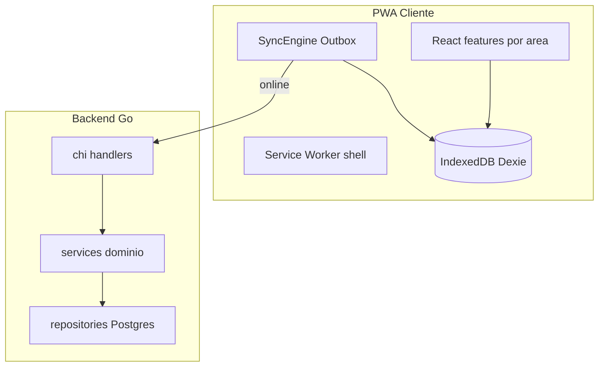

# 🏗️ System Patterns — Cocal Campo

> Arquitetura ratificada (ADR-001 aceito, ADR-002 aceito). Padrões vinculantes para implementação.

## Visão de camadas



## Princípios

1. **Offline-first local** — escrita sempre no IndexedDB; UI lê do store local (`BR-TRANS-001`).
2. **Outbox pattern** — fila com `pendente | sincronizado | erro` (`BR-SYNC-001`, ADR-002).
3. **Idempotência** — `idempotency_key = turno_id:tipo:identificador` (`BR-SYNC-005`).
4. **Servidor árbitro** — validações `TMP-*`, `BR-TURNO-*` no service Go.
5. **Imutabilidade pós-sync** — `synced_at` + bloqueio PATCH operador (`BR-TRANS-004`).
6. **Handlers finos** — handler → service → repository; regras no service.

## Estrutura de repositório

```
backend/
  cmd/api/main.go
  internal/domain/       # modelos, erros ERR-*
  internal/service/      # regras BR-* / TMP-* / INT-*
  internal/repository/   # Postgres
  internal/http/         # handlers, middleware RBAC
  migrations/
frontend/
  src/features/          # auth, turno, sync, home, colheita, transporte
  src/lib/db/            # Dexie schema + outbox
  src/lib/sync/          # SyncEngine
  src/lib/auth/          # sessão offline 7d
  src/lib/api/           # cliente HTTP
```

## Códigos de erro HTTP

| Código | HTTP | Regra |
|--------|------|-------|
| `ERR-TURNO-002` | 409 | `BR-TURNO-002` — turno aberto duplicado |
| `ERR-TURNO-003` | 403 | `BR-TURNO-003` — turno fechado |
| `ERR-TMP-001` | 422 | `TMP-001` — timestamp futuro |
| `ERR-TMP-002` | 422 | `TMP-002` — sem turno aberto |
| `ERR-SYNC-CONFLICT` | 409 | `BR-SYNC-005` — first-sync-wins |
| `ERR-ACESSO-001` | 403 | `BR-ACESSO-001` — perfil não autorizado |

## Auth (`BR-ACESSO-004`)

- Login online → access JWT (30 min) + refresh token (7 dias, rotacionável).
- Refresh e claims cacheados no IndexedDB para operação offline.
- Middleware Go valida `perfil`, `area`, escopo unidade/frente.
- Logout invalida refresh no servidor e limpa store local.

## Sync (ADR-002)

Ver [`docs/architecture/ADR-002-sync-outbox.md`](../docs/architecture/ADR-002-sync-outbox.md).

## Testes

| Tipo | Onde | Ferramenta |
|------|------|------------|
| Unit backend | `backend/internal/**/**_test.go` | `go test ./...` |
| Integração backend | `backend/internal/repository/*_integration_test.go` | `go test -tags=integration` (requer Postgres) |
| Unit frontend | `frontend/src/**/*.test.ts` | Vitest |
| E2E fundação | `frontend/e2e/` | Playwright |
| Campo manual | `docs/tests/` | checklist G3 |

Testes com `//go:build integration` ficam **fora** do `go test ./...` padrão (CI e `npm run test:backend`).

## Referências

- [ADR-001](../docs/architecture/ADR-001-stack.md)
- [ADR-002](../docs/architecture/ADR-002-sync-outbox.md)
- [Catálogo BR-*](../docs/business/README.md)

**Última atualização**: 2026-06-15
